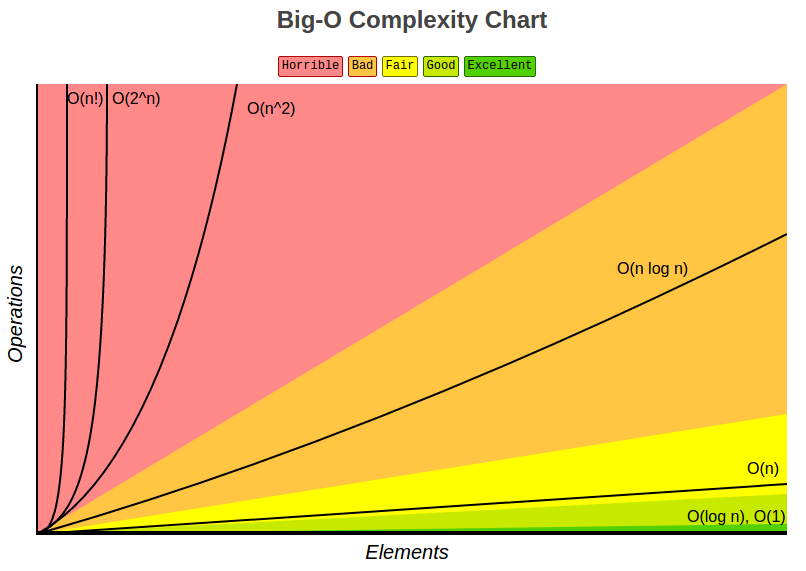
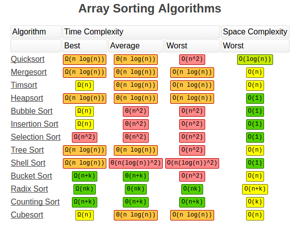
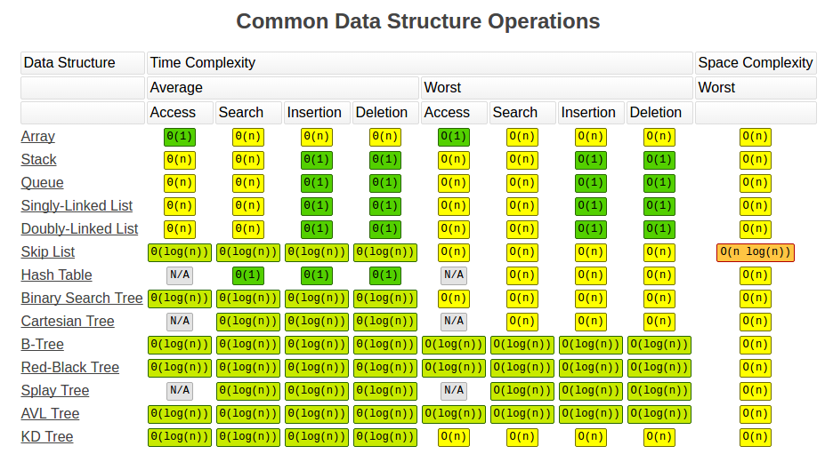

# DataStructures & Algorithms

## Know the Algo Complexities!
  
   Asymptotic(Time & space)

|| |
|----------------------------------|
||

- [MIT Big-O](http://web.mit.edu/16.070/www/lecture/big_o.pdf)
- [Khan Acedamy](https://www.khanacademy.org/computing/computer-science/algorithms/asymptotic-notation/a/asymptotic-notation)
- [Stackoverflow with Big-O](http://stackoverflow.com/questions/487258/what-is-a-plain-english-explanation-of-big-o-notation)
   
